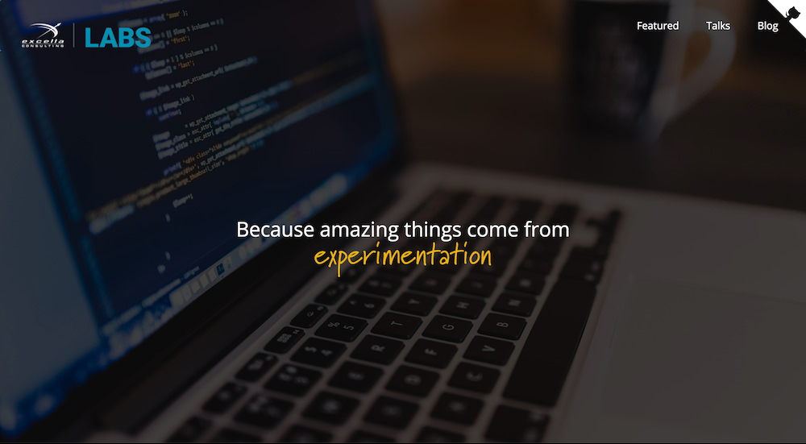

# Excella Labs Website
> Excella Labs is a place for Excella’s technologists to share the new and experimental projects we're working on.

The Excella Labs project is an experiment in and of itself, intent on aggregating Excella's new and upcoming projects, meetups, blog posts, and more
from our various microservices via RESTful apis. Built on a foundation of `create-react-app`, `Redux`, and `Jest`, this static React app will continually
evolve, demonstrating React and JS best practices.



## Process & Contributions
- GitHub issues are used to manage bugs, new features and tasks
- Scrum board view is generated from GitHub issues on [Waffle.io](https://waffle.io/excellalabs/labs-website)
### How Do We Do Agile using GitHub & Waffle?
- Sprints and Releases are created as milestones in GitHub
- Scrum board on Waffle can be filtered by milestone to get a sprint/release specific view
- Issues can be assigned story-points on Waffle
- Waffle maintains order of issues on the board, which indicates priority
- As card are dragged and dropped in Waffle, GitHub labels are add/removed to/from issues accordingly.
- If labels are added to issues from GitHub or the command line, cards are moved to the correct column in Waffle.

### Scrum Process
> The process is suggested as a series of columns in Waffle as labels applied GitHub issues.
- *Backlog:* Any open issues automatically show up in this column. Filter the board by milestone to see a sprint/release backlog. Order of cards indicate priority.
- *In Analysis/Design:* Place issues that are under active analysis or UI/UX design.
- *In Progress:* Let others know you're working on an issue by dragging it to In Progress.
- *Resolved:* When development of an issue is completed move it to this column, so testers or Product Owner can review.
- *In Review:* Move issues in active review to this column. If approved move it Done, if not back to the Backlog with the 'failed' label attached to it.
- *Done:* Closed issues are shown in this column. Drag issues here to close them.
### UI/UX Design Process
> More to come in this section about how we applied UX design principles and interviews with stakeholders to create the right solution the first time.
### Contribute
- Feel free to submit updates or new features by creating a pull request

## Tech Stack and Architecture
- `create-react-app`
- ReactJS
- Express
- Node
- Alpine Linux

## DevOps Stack
- npm scripts to build ReactJS app leveraging `react-scripts`
- npm scripts to build container images leveraging [minimal-node-web-server](https://hub.docker.com/r/duluca/minimal-node-web-server/) and `docker cli` tools
- npm scripts to deploy application leveraging `aws cli tools` with a no-downtime blue/green deployment scheme
- TravisCI (work in progress)

## Hosting Environment
- Highly-available resilient configuration
  - AWS ECS Cluster running two `m4` class EC2 instances across two availability zones (AZs)
  - ECS managed Application Load Balancer (ALB) maintaining minimum two containers/tasks running during normal operation
  - Four containers running during blue/green deployment
- Lot's of headroom for auto-scaling setup and running more experimental apps -- see performance numbers below
- Domain and SSL certificated hosted using Route53
- HTTP/HTTPS routing and reverse proxy managed by ALB, including SSL cert application
- HTTP -> HTTPS routing enforced by [minimal-node-web-server](https://hub.docker.com/r/duluca/minimal-node-web-server/)

## Performance Numbers
- Docker Container image size ~60mb
- RAM usage at idle ~65mb per container
- ~2,200 user per second, Cluster utilization: 6.6% cpu, 1.5% mem
- TODO: Further optimize throughput and latency by hosting image assets on S3 and utilizing CloudFront for caching static assets

## For Developers
### Running the Code
After cloning the repository, run the following commands:
* `npm install` -- this will install the app's dependencies
* `npm start` -- this will bundle everything, start the dev and json servers, and open your default browser to the app

### Building and Testing
* `npm run docker:build` to build the Docker image
* `npm run docker:debug` to test the Docker image

### Push Button Deployments
> Below instruction have not been tested on a Windows environment
* Create `.env` file and set `AWS_ACCESS_KEY_ID` and `AWS_SECRET_ACCESS_KEY`
  * Sample `.env` file:
  ```Bash
    AWS_ACCESS_KEY_ID=your_own_key_id
    AWS_SECRET_ACCESS_KEY=your_own_secret_key
  ```
* Install AWS CLI
  * Mac: `brew install awscli`
* Log in to AWS CLI with your credentials
  * Run `aws configure`
  * You'll need your Access Key ID and Secret Access Key
  * Default region name: us-east-1
* `npm run aws:release` to configure Docker with aws, publish your latest image build and release it on ECS